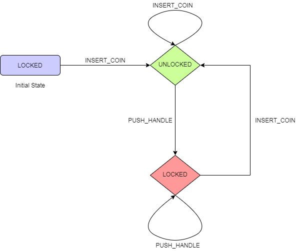

# Coin-Operated Turnstile State Machine

This state machine has 2 possible states -

1. Locked
2. Unlocked

'Locked' is the initial state assigned to the state-machine. All possible state transitions are shown in the below table -

| Current State | Input | Next State | Output                                                       |
| :------------ | :---- | :--------- | :----------------------------------------------------------- |
| Locked        | Coin  | Unlocked   | Unlocks the turnstile so that the customer can push through. |
| Locked        | Push  | Locked     | None                                                         |
| Unlocked      | Coin  | Unlocked   | None                                                         |
| Unlocked      | Push  | Locked     | When the customer has pushed through, locks the turnstile.   |

## State Transitions

