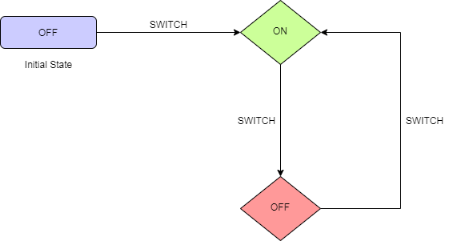

# Switch State Machine

This state machine has 2 possible states -

1. On
2. Off

'Off' is the initial state assigned to the state-machine. All possible state transitions are shown in the below table -

| Current State | Input  | Next State | Output         |
| :------------ | :----- | :--------- | :------------- |
| Off           | Switch | On         | Switch is On.  |
| On            | Switch | Off        | Switch is Off. |

## State Transitions

